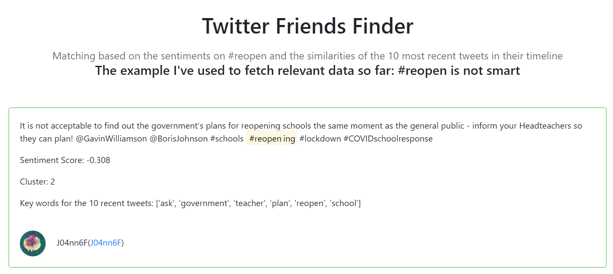

### #Twitter Friend Finder
#### Data questions:
* Find the twitter users similar with you based on the tweet similarity
  * The sentiments on #reopen
  * The 10 recent tweets from the matched (having the close sentiments on step one) user’s timelines
* What features determine if a tweet will be retweeted? 
#### Data source: 
* User Twitter Search API to fetch the tweets containing #reopen
#### Screenshots

